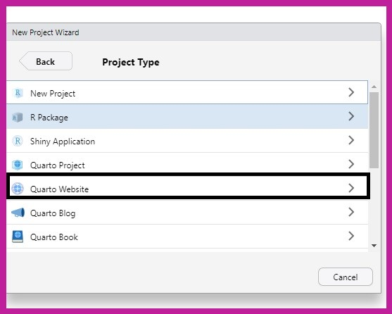
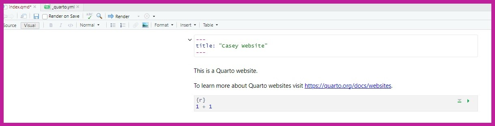
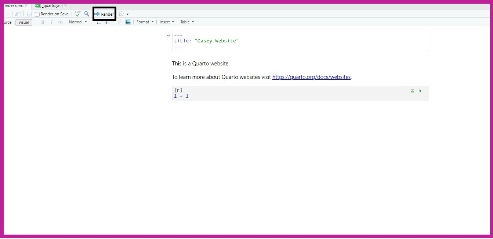
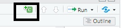
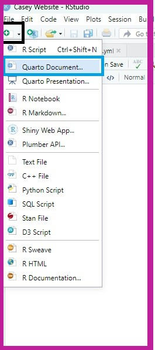
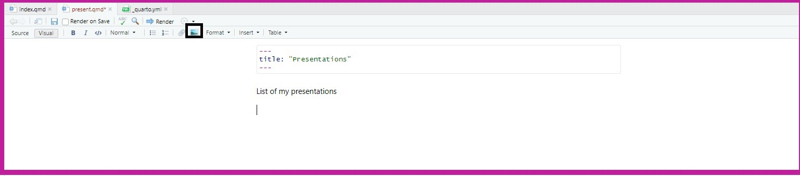
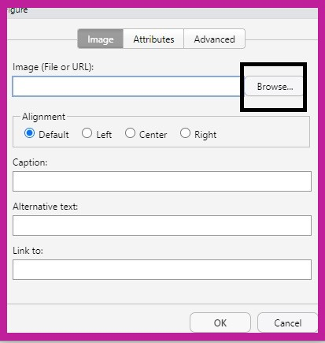
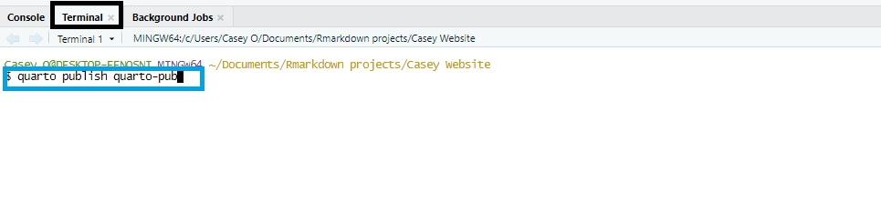

```{r setup, include=FALSE}
options(htmltools.dir.version = FALSE)
library(knitr)
knitr::opts_chunk$set(warning = FALSE, message = FALSE)
# options(knitr.table.format = "html")
library(tidyverse)
library(babynames)
library(fontawesome) # from github: https://github.com/rstudio/fontawesome
library(DiagrammeR)
```

name: context
class: center, middle, inverse

# .fancy[The (much too) common perspective on `r fa("r-project", fill="#4287f5")`:]


???
Presentation notes here

--


---
name: tonight
class: left, top, inverse

#.fancy[.salt[Tonight:]]

##.fancy[We'll be using both the "legacy" .rblue[rmarkdown] packages as well as the "new" .rblue[Quarto] platform to generate:]

--

? Whatever we decide to present goes here (put in images of website, report, etc)


---
name: Building Websites in Quataro
class: left


From the file menu, click File -> New Project

Select New Directory -> Quarto Website

Choose a name for your new directory


Select New Directory

---
class: left, top, inverse


Select Quarto Website. 


Then, create a name for your website in the black box and the save the quarto website somewhere in your local computer using the blue box. 

---



Here are the two different files you should have when your done

---


If you click on Render, here is how the results would look like
---
To build plots and graphs, we will use R script. To add a new chuck on r script in our quarto document, we will hit the plus C green button and the top right



Next, we will add our script to create our visualization 


And you will get an interactive plot that allows you look average body mass for penguins split by their species and sex
---


To create a new tab in your website, you want hit the the paper with the green plus, then select quarto document. After, you to give a title and make sure that is selected on HTML. 
---

The title is what the name of your new tab is going to be. After you want to save the file by clicking on the floppy disk and name it whatever you want. 

Lastly, you will add it into the quarto.yml, by putting it under about.qmd, and it will "- name of your file.qmd"

---



To add you an image you can hit the image button. 



Then, you will hit browse and find the file you to upload to the your website


The image should already be saved in the folder with the qmd script. 

---

There you have your penguins!

---
The hardest part it is time to publish all of our work, so we can share our website with others. 

You want to head over to quartopub.com and create an account. 

Once, you have done that, you go to the terminal and type in "quarto publish quarto-pub"


Next, it will ask for you login information that you used to sign up for quarto.

Then, it will ask you if you are fine with the name you have originally choosen. 

And your done!
---


class: left, top, inverse

# .salt[.fancy[Questions???]]
## .fancy[Reach out to us at...]

.pull-left[
  

Mike <br>

  

Casey
]

.pull-right[

Diego <br>

  

[`r fa(name = "paper-plane")` jtkulas@ergreports.com](mailto:jtkulas@ergreports.com)  
[`r fa(name = "x-twitter")` @jtkulas](http://twitter.com/jtkulas)  
[`r fa(name = "youtube")` Forensic Psychometrics](https://www.youtube.com/@forensicpsychometrics8300)
]

