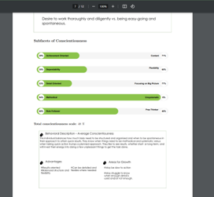
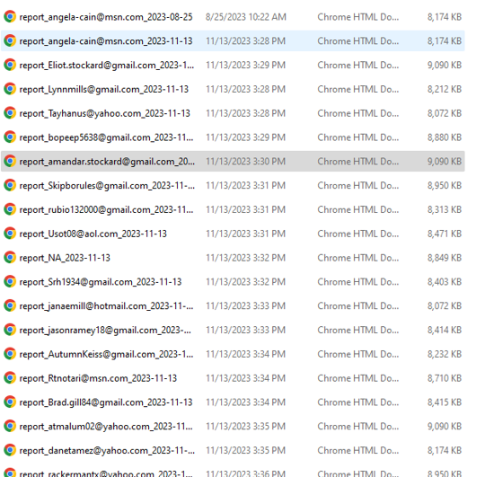

```{r setup, include=FALSE}
options(htmltools.dir.version = FALSE)
library(knitr)
knitr::opts_chunk$set(warning = FALSE, message = FALSE)
# options(knitr.table.format = "html")
library(tidyverse)
library(babynames)
library(fontawesome) # from github: https://github.com/rstudio/fontawesome
library(DiagrammeR)
```

---
name: paramintro
class: center, top, inverse

# .fancy[.salt[Parameterized] reports with Quarto:]

.pull-left[

]

.pull-right[

] 

---
class: left, top, inverse

# .fancy[Scope of parameterization tutorial:]

.pull-left[.large[
1. Choosing scope of reports
  + How do you want to "slice" the data? 
2. Specify parameters
  + script & `YAML`
  + Variable vs. value
3. Auto-generate parameterized reports 
4. *You* can then take and slice your own data as desired]
]


---
name: Diegocontext
class: left, top, inverse

# .fancy[Example #1:]
## .fancy[..automating parameters in your `r fa("r-project", fill="#4287f5")` report]

--

.pull-left[
# .fancy[Let's say you have a very elaborate Quarto script…]
]


---
name: Diegoslide2
class: left, top, inverse

#.fancy[… and you want to change the data and/or parameters used to generate the plots, graphs, tables and text in your reports without having to edit your script or write new code]


---
name: Diegoslide3
class: left, top, inverse

#.fancy[So you can generate reports like these:]


```{r viz, echo=TRUE, eval=FALSE, results='hide'}
library(palmerpenguins)
df1<-penguins%>%filter(year==params$year)
df1 %>%
ggplot() +
 aes(x = island) +
 geom_bar(fill = "#0c4c8a") +
 theme_minimal()
```


     

     


---
name: Diegoslide4
class: left, top, inverse

#.fancy[Use parameters!]

--


     
---
name: Diegoslide5
class: left, top, inverse

#.fancy[Example #2]

## .fancy[Let's say your data looks like this:]

```{r data}
df<-read.csv("percentiles scores.csv")
kable(df)
```

---
name: Diegoslide6
class: left, top, inverse

# .fancy[...and you want to .spssred[automate] individual reports for each respondent]


     



---
name: Diegoslide7
class: left, top, inverse

#.fancy[Parameters again!]

## .fancy[...this time a little bit more complicated:]


     
---
name: Diegoslide8
class: left, top, inverse

#.fancy[Your output:]


     
---
class: center

# .fancy[Breakout Rooms #3]


---
class: left, top, inverse

##.salt[.fancy[Additional resources:]]

.pull-left[
###.fancy[Alison Hill]: 
+ [`r fa("github")`](https://github.com/apreshill) Source code
+ [`r fa("youtube", fill="red")`](https://www.youtube.com/channel/UCQYM-t2ut2zXr4d7TIFya1A) Tutorials
+ [`r fa("blog")`](https://www.apreshill.com/) Personal blog
]

.pull-right[
###.fancy[Yihui Xie]:  
+ [`r fa("github")`](https://github.com/yihui) Source code & sassy talk
+ [`r fa(name = "x-twitter")`](https://twitter.com/xieyihui?lang=en) Twitter stuff
+ [`r fa("blog")`](https://yihui.org/) Personal blog  

###.fancy[Posit PBC]:  
+ [`r fa("youtube", fill="red")`](https://www.youtube.com/@PositPBC) Tutorials (Tom Mock does Quarto)
+ [`r fa("message")`](https://community.rstudio.com/) Discussion forum
+ [`r fa(name="x-twitter")`](https://twitter.com/posit_pbc) Not very active


]

---

class: left, top, inverse

# .salt[.fancy[Questions???]]
### .fancy[Connect with us at...]


  

  

 

.pull-left[`r fa(name = "envelope", fill="#B4B4B4")` [caseyosorio@gmail.com](mailto:caseyosorio@gmail.com)  
[`r fa("linkedin", fill="#0077b5")` @Casey Osorio-Duffoo](https://www.linkedin.com/in/casey-osorio-duffoo/)
<br>
<br>
<br>
<br>
<br>
<br>
<br>

[`r fa(name = "envelope", fill="#B4B4B4")` defabiism1@montclair.edu](mailto:defabiism1@montclair.edu)
]

.pull-right[
[`r fa(name = "envelope", fill="#B4B4B4")` figueirasd1@montclair.edu](mailto:figueirasd1@montclair.edu) <br>
[`r fa("linkedin", fill="#0077b5")` @Diego Figueiras](https://www.linkedin.com/in/diego-figueiras-m-a-012644123/)

<br>
<br>
<br>
<br>
<br>

[`r fa(name = "envelope", fill="#B4B4B4")` jtkulas@ergreports.com](mailto:jtkulas@ergreports.com)  
[`r fa(name = "x-twitter")` @jtkulas](http://twitter.com/jtkulas)  
[`r fa(name = "youtube", fill="red")` Forensic Psychometrics](https://www.youtube.com/@forensicpsychometrics8300)
]