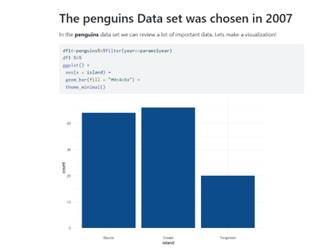
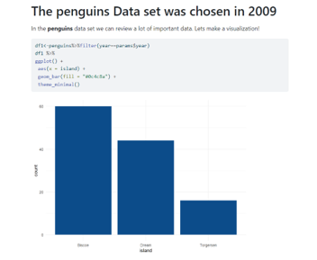
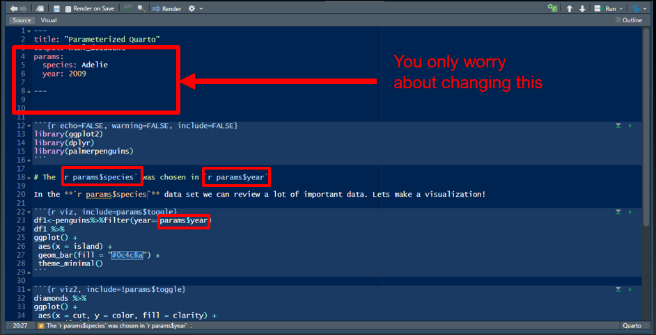
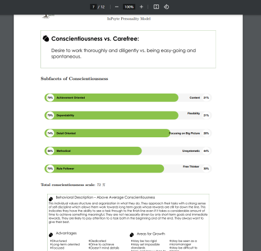
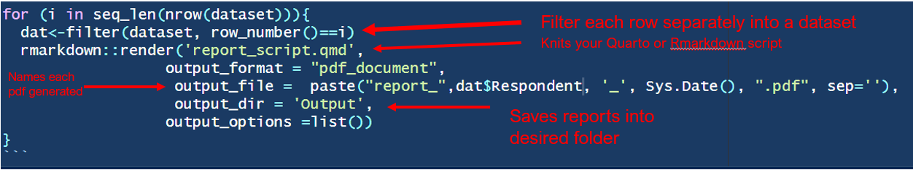

```{r setup, include=FALSE}
options(htmltools.dir.version = FALSE)
library(knitr)
knitr::opts_chunk$set(warning = FALSE, message = FALSE)
# options(knitr.table.format = "html")
library(tidyverse)
library(babynames)
library(fontawesome) # from github: https://github.com/rstudio/fontawesome
library(DiagrammeR)
```

name: context
class: center, middle, inverse

# .fancy[Example #1: automating parameters in your report `r fa("r-project", fill="#4287f5")`]

???
Presentation notes here

--
# .fancy[Let's say you have a very elaborate Quarto script…]

     

     


---
name: slide2
class: left, top, inverse

#.fancy[… and you want to change the data and/or parameters used to generate the plots, graphs, tables and text in your reports without having to edit your script or write new code]


--

---
name: slide3
class: left, top, inverse

#.fancy[Example #1]

Like this:


     
     

     
     


--


---
name: slide4
class: left, top, inverse

#.fancy[Use parameter automation!]

Like this:


     


--


---
name: slide5
class: left, top, inverse

#.fancy[Example #2]

Let's say your data looks like this:


     


--


---
name: slide6
class: left, top, inverse

#.fancy[Example #2]

And you want to automatically knit a report for each respondent



     

     
     

     


--


---
name: slide7
class: left, top, inverse

#.fancy[Example #2]

Automation again!

This time a little bit more complicated



     

--

---
name: slide8
class: left, top, inverse

#.fancy[Example #2]


     

--


---

class: left, top, inverse

# .salt[.fancy[Questions???]]
## .fancy[Reach out to us at...]

.pull-left[
  

Mike <br>

  

Casey
]

.pull-right[

Diego <br>

  

[`r fa(name = "paper-plane")` jtkulas@ergreports.com](mailto:jtkulas@ergreports.com)  
[`r fa(name = "x-twitter")` @jtkulas](http://twitter.com/jtkulas)  
[`r fa(name = "youtube")` Forensic Psychometrics](https://www.youtube.com/@forensicpsychometrics8300)
]

