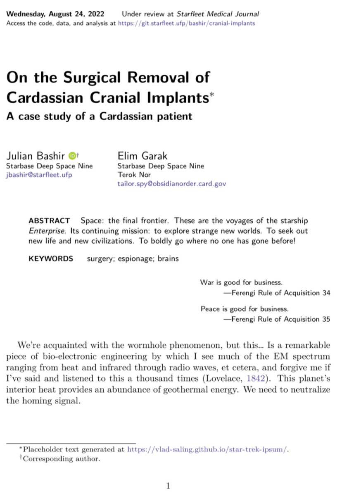
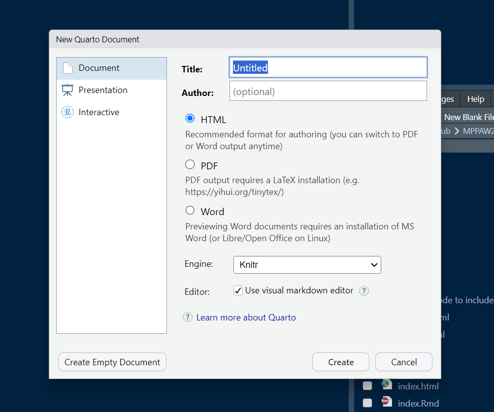
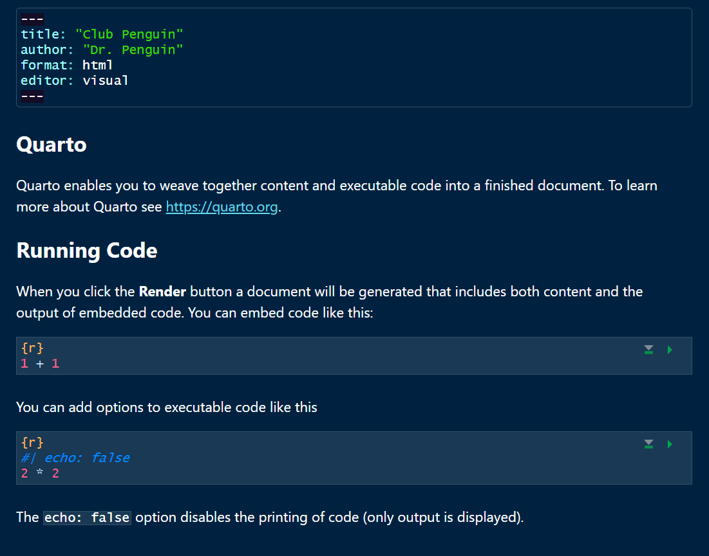
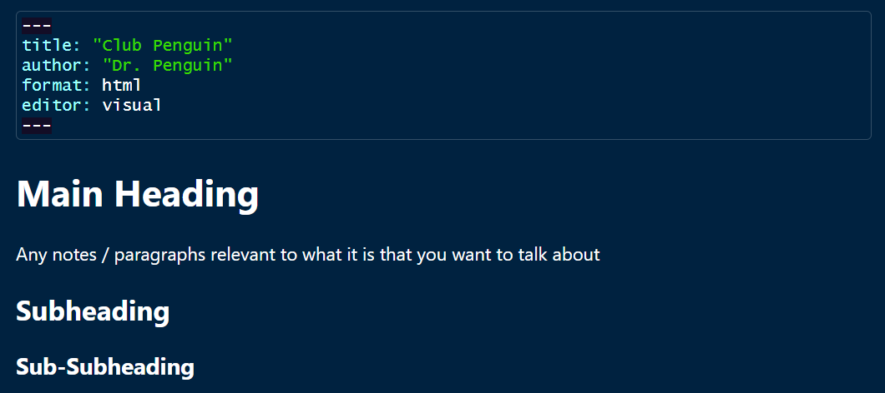
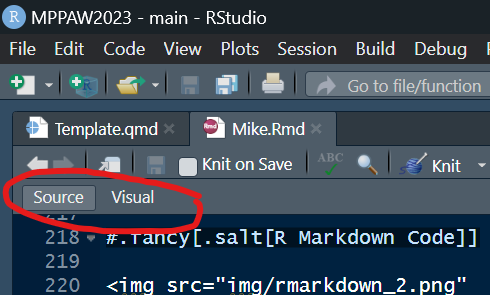
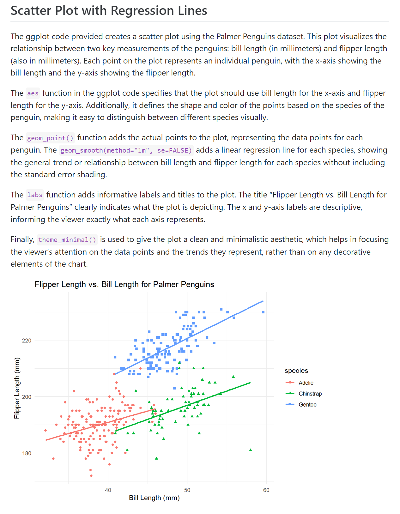

```{r setup, include=FALSE}
options(htmltools.dir.version = FALSE)
library(knitr)
knitr::opts_chunk$set(warning = FALSE, message = FALSE)
# options(knitr.table.format = "html")
library(tidyverse)
library(babynames)
library(fontawesome) # from github: https://github.com/rstudio/fontawesome
library(DiagrammeR)
```

name: context
class: center, middle, inverse

# .fancy[Creating A Template Business Report Using `r fa("r-project", fill="#4287f5")`:]


  

???
Presentation notes here

--
.pull-left[
(1) Choosing your desired .spssred[**template**] and .spssred[**doc type**]
]
--
.pull-right[
(2) Basic .rblue[**Markdown**] code
]

---
name: templates
class: left, top, inverse

#.fancy[.salt[Templates]]

##.fancy[Many templates can be used:]

--

--


--


--
<br>
<br>
<br>
<br>
<br>
<br>
<br>
<br>
<br>
<br>
##.fancy[All you need to do is find them!]

---
name: formats
class: left, top, inverse

#.fancy[.salt[Formats]]

##.fancy[Three main output types to choose from:]

--


--


--


---

name: formats
class: left, top, inverse

#.fancy[.salt[Formats]]

##.fancy[Choosing a format is easy!]


---
name: formats
class: left, top, inverse

#.fancy[.salt[Formats]]

##.fancy[Choosing a format is easy!]


     
--


---
name: formats
class: left, top, inverse

#.fancy[.salt[Formats]]

##.fancy[Choosing a format is easy!]


     
---
name: formats
class: left, top, inverse

#.fancy[.salt[Formats]]

##.fancy[Choosing a format is easy!]


     

     
--


     


---
name: formats
class: left, top, inverse

#.fancy[.salt[Formats]]

##.fancy[Choosing a format is easy!]


     

     
---

name: rmarkdown
class: left, top, inverse

#.fancy[.salt[Markdown Code]]
##.fancy[Use this to structure your document]

---
name: rmarkdown
class: left, top, inverse

#.fancy[.salt[Markdown Code]]


---

name: rmarkdown
class: left, top, inverse

#.fancy[.salt[Markdown Code]]



---

name: rmarkdown
class: left, top, inverse

#.fancy[.salt[Markdown Code]]
##.fancy[Use the 'Source' editing mode to see syntax]



---

name: rmarkdown
class: left, top, inverse

#.fancy[.salt[Markdown Code]]
##.fancy[Use the 'Source' editing mode to see syntax]


---

name: rmarkdown
class: left, top, inverse

#.fancy[.salt[Markdown Code]]
##.fancy[Use the 'Visual' editing mode to see the organized version]


---

name: rmarkdown
class: left, top, inverse

#.fancy[.salt[Markdown Code]]
##.fancy[Use the 'Visual' editing mode to see the organized version]


---

name: rmarkdown
class: left, top, inverse

#.fancy[.salt[Markdown Code]]
##.fancy[Insert an R code chunk with /]


---

name: markdown
class: left, top, inverse

###.fancy[.salt[Markdown]]
##.fancy[Use the backtick ` to write R code inline]

--


     
--


---
name: example
class: left, top, inverse

###.fancy[.salt[Here's an example document!]]


     


---
class: left, top, inverse

# .salt[.fancy[Questions???]]
## .fancy[Reach out to us at...]

.pull-left[
  

Mike <br>

  

Casey
]

.pull-right[

Diego <br>

  

[`r fa(name = "paper-plane")` jtkulas@ergreports.com](mailto:jtkulas@ergreports.com)  
[`r fa(name = "twitter")` @jtkulas](http://twitter.com/jtkulas)  
[`r fa(name = "youtube")` Forensic Psychometrics](https://www.youtube.com/@forensicpsychometrics8300)
]

