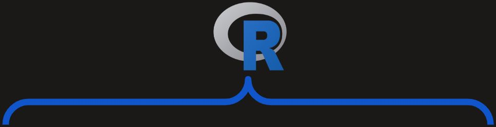
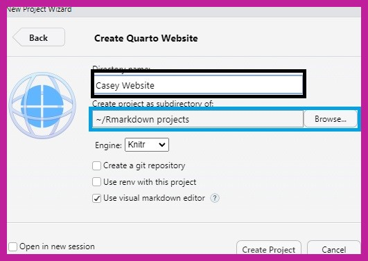
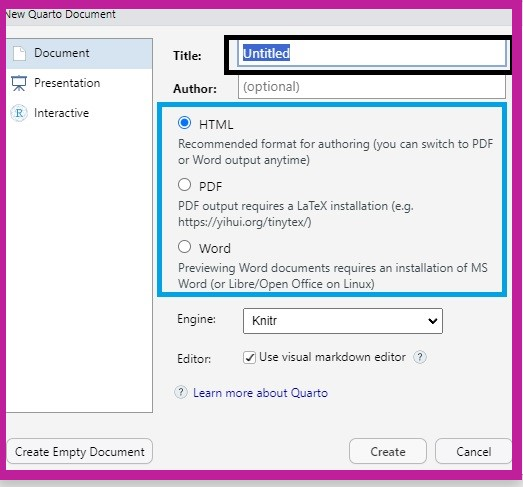
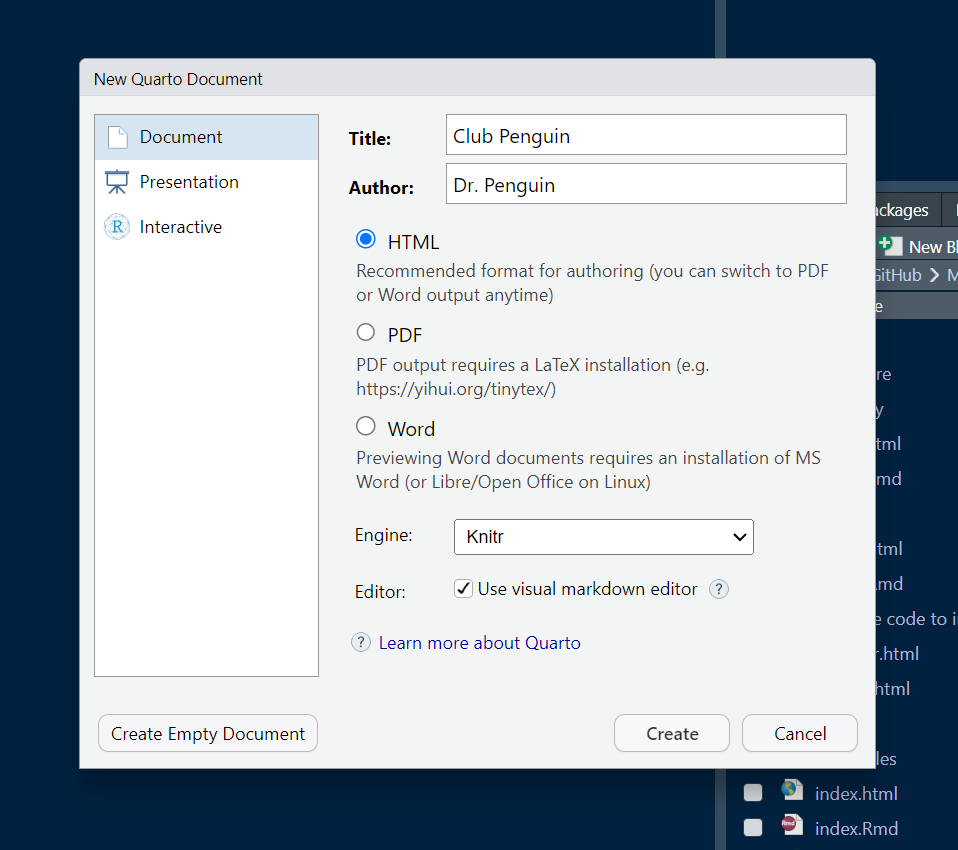
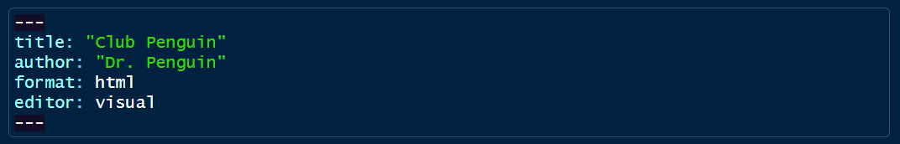
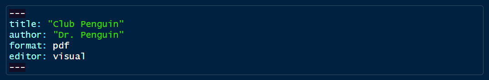
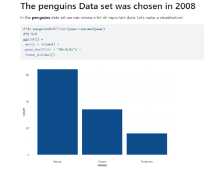

```{r setup, include=FALSE}
options(htmltools.dir.version = FALSE)
library(knitr)
knitr::opts_chunk$set(warning = FALSE, message = FALSE)
# options(knitr.table.format = "html")
library(tidyverse)
library(babynames)
library(fontawesome) # from github: https://github.com/rstudio/fontawesome
library(DiagrammeR)
library(xaringanExtra)
```


```{r xaringan-scribble, echo=FALSE, eval=FALSE}

## https://pkg.garrickadenbuie.com/xaringanExtra/#/scribble

xaringanExtra::use_scribble()          ## page load times much worse with this enabled - allows marking on slides
## xaringanExtra::use_slide_tone()     ## use for visually impaired

```

layout: true
  
<div class="my-footer"><span><a href="https://github.com/jtkulas/MPPAW2023"</span>MPPAW November 14, 2023</span></a></div> 

<!-- this adds the link footer to all slides, depends on my-footer class in css-->

---
name: xaringan-title
class: left, top, inverse
background-image: url(img/learn2.jpg)
background-size: cover 

# 

<!-- -->

# .fancy2[.BLACK[Everything **BUT** Statistics]]  
### .fancy2[.BLACK[`r fa("r-project",fill="#000000")` for Authoring Websites, Reports, and <br>Presentations ...Oh My!!]]

.large[[`r fa("linkedin", fill="#0077b5")`](https://www.linkedin.com/in/michael-defabiis-84b45b162/) .BLACK[| Mike DeFabiis ] <br>
[`r fa("linkedin", fill="#0077b5")`](https://www.linkedin.com/in/diego-figueiras-m-a-012644123/) .BLACK[| Diego Figueiras ] <br>
[`r fa("linkedin", fill="#0077b5")`](https://www.linkedin.com/in/casey-osorio-duffoo/) .BLACK[| Casey Osorio-Dufoo ] <br>
[`r fa("linkedin", fill="#0077b5")`](https://www.linkedin.com/in/johntkulas/) .BLACK[| John Kulas ]
]

<!-- this ends up being the title slide since seal = FALSE -->

---
name: context
class: center, middle, inverse

# .fancy[The (much too) common perspective on `r fa("r-project", fill="#4287f5")`:]

--
.pull-left[
I have a statistical program <br>.spssred[(**I currently use**)]
]
--
.pull-right[
I have a statistical program <br>.rblue[(**I'm gonna switch to**)]
]

--


---

class: center, middle, inverse

#.fancy[However...]
##.fancy[...`r fa("r-project", fill="#4287f5")` is not just a statistical substitute]

--

##.fancy[It is actually a .rblue[multipurpose] operating environment]


---
name: new
class: center, top, inverse

# .fancy[A better (more useful) perspective on `r fa("r-project", fill="#4287f5")`:]

--
.pull-left[
I have many platforms <br>.spssred[(**I currently use to navigate my job**)]<br>


]

???
Power of replacement actually comes from Quarto (presented on later slides), with `r fa("r-project", fill="#4287f5")` merely being one current way to use Quarto

--
.pull-right[
I have a 1 (free) platform <br>.rblue[(**to rule them all**)]<br>


]


---

name: better
class: center, top, inverse

# .fancy[Common processes `r fa("r-project", fill="#4287f5")` can power:]  

???

1. statistics
2. presentations
3. websites
4. academic manuscripts
5. books
6. dissertations & theses
7. technical reports
8. dashboards

And much more. Only really limited by YOUR creativity & vision.

--



--


--


     
--


--


--


     
--


--


     
--


     
--


---
name: how
class: center, top, inverse

##.fancy[`r emo::ji("face_with_raised_eyebrow")` How? `r emo::ji("dizzy_face")`]

--

.pull-left[
## .salt[.fancy[Packages!!]]


     

     

]

--


 
 

---
name: whazzr
class: center, middle, inverse


???
+ Language and platform basically indistinguishable
+ Application typical software program
  + Bell labs and/or U of Aukland "product"
  + 1993 first release
+ Free/open-source
+ Two primary operating environments (interactive **console** and static **script**)
+ Philosophy: function over form

--


---
name: whazzrstudio
class: center, middle, inverse


???
+ Commercial application (but also free) - background here: [`r fa("youtube", fill="red")`](https://www.youtube.com/watch?v=u1Gzxg8Pd08)
+ "Founded" roughly 2009
+ Facilitates use of `r fa("r-project")`
+ Function maintained, form improved
  + 4 operating environments
+ Blurred boundaries (we'll refer to `r fa("r-project")` even if we're technically operating within `r fa("r-project")` Studio)  
+ If anyone hasn't installed `r fa("r-project")` or `r fa("r-project")` Studio, **send a private chat to Roger** - he will let us know and we'll help in breakout rooms during intro spiel 

--


---
name: packages
class: center, top, inverse

.pull-left[
## .fancy[[`r fa("r-project", fill="#4287f5")` Packages](https://support.posit.co/hc/en-us/articles/201057987-Quick-list-of-useful-R-packages):]
]

???
+ data visualization
+ data manipulation

--


--


     
--


     
--

.pull-right[
## .fancy[`r fa("r-project", fill="#4287f5")` "Authoring" Packages:]
]  

--


     
--


     
--


---
name: context
class: left, top, inverse

#.fancy[The evolution of authoring packages...]


???
+ $\LaTeX$ & html (dates unknown)
+ literate programming (1984; code + written text)
  + exploding recently - thanks to RStudio & Jupiter Notebooks
+ markdown (2004)

--
     

     
  

---
name: RStudio
class: left, top, inverse

#.fancy[...parallels the evolution of] `r fa("r-project", fill="#4287f5")` .rblue[Studio]:


.pull-left[
#.fancy[`r fa("r-project", fill="#4287f5")` Studio:]


     


]

--


.pull-right[
#.fancy[Posit:]


     


]

???
New branding announced by Hadley Wickham at R Studio 2022 conference - Hadley says Quarto is the new rMarkdown

---
class: center, top, inverse


     

     


--


     


???
Quarto actually an independent platform. There is a Quarto `r fa("r-project", fill="#4287f5")` package, but it mostly provides shortcuts for control-line commands. Deep explanation of Quarto with development team available here: [`r fa("youtube", fill="red")`](https://www.youtube.com/watch?v=p5zrqrFqCTo)

---
name: timing
class: left, top, inverse

# .fancy[Timing (for us as a field):]

.pull-left[
.large[`r fa("r-project")`Studio is a [Public Benefit Corporation](https://www.law.cornell.edu/wex/public_benefit_corporation#:~:text=A%20public%20benefit%20corporation%20is,a%20responsible%20and%20sustainable%20manner.) with a mission to create free and open source software for *data science*, *scientific research*, and .kindabig[.rblue[*technical communication*]]
]
]

.pull-right[

]

???
Hadley and JJ referred to this as their "charter"

---
name: tonight
class: left, top, inverse

#.fancy[.salt[Tonight:]]

##.fancy[We'll be using <s>both the "legacy" .rblue[rmarkdown] packages as well as</s> the "new" .rblue[Quarto] platform to generate:]

???
+ A template business report
+ A website
+ A parameterization of the business report

--


     
--


--


---
class: center, top, inverse

# .fancy[Outline]:

.pull-left[.salt[10-15 minute] <br>.large[overview]]

.pull-right[.heat[10 minute] <br>.large[working session]]

???
+ The breakout sessions will start at 10 minutes 
    + We can extend if necessary/requested after the first 10 minute breakout
+ Slides will be pasted into the chat at the end of each overview section

--


--


     
--


--


--


--


--


     
--


--


---
class: inverse

# .fancy[Prepare for Penguin Onslaught!!! `r emo::ji("penguin")`]


         


     


???
+ `palmerpenguin` package and dataset currently very popular as fun demo dataset
+ supplanting `mtcars` and `iris` which were historically favored

---
name: webintro
class: center, top, inverse

# .fancy[.salt[Websites] with Quarto:]

.pull-left[

]

.pull-right[

]

---
class: left, top, inverse

# .fancy[Scope of website tutorial:]

.pull-left[.large[
1. Basic (simple) website
  + Pictures
  + Data visualization
  + New pages 
2. Local first
3. [Publish](https://quartopub.com/) second
4. *You* can then take and customize as desired]
]


     
---

name: Building Websites in Quatro
class: left, top, inverse

# .fancy[Getting started:]

.pull-left[.large[
1. From the file menu, click:
  + `File -> New Project`
2. Select:
  + `New Directory -> Quarto Website`
3. Create a name for your `website` (in the black box)
4. Choose a name for your `New Project Directory` (blue box)
]
]


--


--


--



---
class: left, top, inverse

# .fancy[The result:]

.large[You should now have two default files:]


---

class: left, top, inverse

# .fancy[Activate!]

.large[Clicking `Render` gives you an html page...]


--


---
class: left, top, inverse

# .fancy[Adding images]

.pull-left[.large[To add you an image you can:
1. hit the `image` icon, then
2. you will hit browse and find the file you want to upload to your website]]


     
???
+ Discuss `source` versus `visual` options while editing
+ The image should already be saved in the folder with the `.qmd` script

--


--


     

---
# .fancy[There you have your penguins!]

```{r echo=FALSE, out.width="70%", fig.align="center"}
knitr::include_graphics("img/Website/penguins.jpg")
```


---
class: left, top, inverse

# .fancy[Adding data visuals:]

.large[To build plots and graphs, we will use `R` script. To add a new .rblue[chunk], we will hit the `plus C` green button:]


???
+ `plus c` located in the upper-right of the menu bar
+ describe what a `chunk` is

--

.large[Next, we will add the `R` commands that will create our visualization:]<br> \* You will be *provided* `R` commands within the breakout sessions (if you'd like) 


---
class: left, top, inverse

# .fancy[A little closer look at that chunk...]

.pull-left[
```{r}

library(palmerpenguins)
library(ggplot2)
library(plotly)

p <- plot_ly(data = penguins, 
             x = ~bill_length_mm, 
             y = ~bill_depth_mm, 
             color = ~species, 
             size = ~body_mass_g, 
             text = ~island, alpha=.7)

```
]

.pull-right[
```{r, echo=FALSE}
htmlwidgets::saveWidget(p, "penguins.html", selfcontained = TRUE, knitrOptions = list())
widgetframe::frameWidget(p) ## trying for online
```
]

???
Run the script and you will get an interactive plot that allows you look average body mass for penguins split by their *species* and *sex*

---
class: left, top, inverse

# .fancy[Adding new pages] (Part I)

.pull-left[.large[
To create a new tab in your website, you want to: 
1. hit the the paper with the green plus, then 
2. select quarto document  

Next, give your page a title and make sure that is selected on `HTML`] 
]


--



---
class: left, top, inverse

# .fancy[Adding new pages] (Part II)

.large[
The title is what the name of your new tab is going to be. After you want to save the file by clicking on the `r fa("floppy-disk", fill="#618DCF")` and name it whatever you want. 
]


---
class: left, top, inverse

# .fancy[Adding new pages] (Part III)

.pull-left[.large[Lastly, you will add your new `.qmd` file into the `quarto.yml`, by putting it under `about.qmd`
  + make sure to be consistent: `"name of your new file".qmd`]
]


     
---
class: left, top, inverse

# .fancy[Publishing - sharing your website] 

.pull-left[.large[
1. head over to [quartopub.com](https://quartopub.com/) and create an account
2. access the `terminal` and type in "**quarto publish quarto-pub**"
  + use the login information that you used to sign up for quarto
  + last chance to change the website name you have originally chosen
  
...and you're done!!
]]


     
---
class: left

# .fancy[Putting all this together...]
## .fancy[...I'll do a quick `live` walk-through]

.large[
1. Create local project & files
2. Publish on [quartopub.com](https://quartopub.com/)
]


---
class: center

# .fancy[Breakout Rooms #1]


---
name: reportintro
class: center, top, inverse

# .fancy[.salt[Reports] with Quarto:]

.pull-left[

]

.pull-right[

]   

---
class: left, top, inverse

# .fancy[Scope of reports tutorial:]

.pull-left[.large[
1. Choosing your desired report
  + .spssred[**template**] and 
  + .spssred[**doc type**]
2. Adding
  + .rblue[**graphs**]
  + .rblue[**tables**], and 
  + .rblue[**descriptives**]
3. *You* can then take and apply your own data as desired]
]


     

---
---
name: templates
class: left, top, inverse

#.fancy[.salt[Templates]]

##.fancy[Many templates can be used:]

--

--


--


--
<br>
<br>
<br>
<br>
<br>
<br>
<br>
<br>
<br>
<br>
##.fancy[All you need to do is find them!]

---
name: formats1
class: left, top, inverse

#.fancy[.salt[Formats]]

##.fancy[Three main output types to choose from:]

--


--


--


---

name: formats2
class: left, top, inverse

#.fancy[.salt[Formats]]

##.fancy[Choosing a format is easy!]


---
name: formats3
class: left, top, inverse

#.fancy[.salt[Formats]]

##.fancy[Choosing a format is easy!]


     
--


---
name: formats4
class: left, top, inverse

#.fancy[.salt[Formats]]

##.fancy[Choosing a format is easy!]


     
---
name: formats5
class: left, top, inverse

#.fancy[.salt[Formats]]

##.fancy[Choosing a format is easy!]


     

     
--


     


---
name: formats6
class: left, top, inverse

#.fancy[.salt[Formats]]

##.fancy[Choosing a format is easy!]


     

     
---

name: rmarkdown1
class: left, top, inverse

#.fancy[.salt[Markdown Code]]
##.fancy[Use this to structure your document]

---
name: rmarkdown2
class: left, top, inverse

#.fancy[.salt[Markdown Code]]


---

name: rmarkdown3
class: left, top, inverse

#.fancy[.salt[Markdown Code]]


---

name: rmarkdown4
class: left, top, inverse

#.fancy[.salt[Markdown Code]]
##.fancy[Use the 'Source' editing mode to see syntax]


---

name: rmarkdown5
class: left, top, inverse

#.fancy[.salt[Markdown Code]]
##.fancy[Use the 'Source' editing mode to see syntax]


---

name: rmarkdown6
class: left, top, inverse

#.fancy[.salt[Markdown Code]]
##.fancy[Use the 'Visual' editing mode to see the organized version]


---

name: rmarkdown7
class: left, top, inverse

#.fancy[.salt[Markdown Code]]
##.fancy[Use the 'Visual' editing mode to see the organized version]


---

name: rmarkdown8
class: left, top, inverse

#.fancy[.salt[Markdown Code]]
##.fancy[Insert an R code chunk with /]


---

name: markdown9
class: left, top, inverse

###.fancy[.salt[Markdown]]
##.fancy[Use the backtick ` to write R code inline]

--


     
--


---
name: example
class: left, top, inverse

###.fancy[.salt[Here's an example document!]]


     


---
class: center

# .fancy[Breakout Rooms #2]


---
name: paramintro
class: center, top, inverse

# .fancy[.salt[Parameterized] reports with Quarto:]

.pull-left[

]

.pull-right[

] 

---
class: left, top, inverse

# .fancy[Scope of parameterization tutorial:]

.pull-left[.large[
1. Choosing scope of reports
  + How do you want to "slice" the data? 
2. Specify parameters
  + script & `YAML`
  + Variable vs. value
3. Auto-generate parameterized reports 
4. *You* can then take and slice your own data as desired]
]


---
name: Diegocontext
class: left, top, inverse

# .fancy[Example #1:]
## .fancy[..automating parameters in your `r fa("r-project", fill="#4287f5")` report]

--

.pull-left[
# .fancy[Let's say you have a very elaborate Quarto script…]
]


---
name: Diegoslide2
class: left, top, inverse

#.fancy[… and you want to change the data and/or parameters used to generate the plots, graphs, tables and text in your reports without having to edit your script or write new code]


---
name: Diegoslide3
class: left, top, inverse

#.fancy[So you can generate reports like these:]


```{r viz, echo=TRUE, eval=FALSE, results='hide'}
library(palmerpenguins)
df1<-penguins%>%filter(year==params$year)
df1 %>%
ggplot() +
 aes(x = island) +
 geom_bar(fill = "#0c4c8a") +
 theme_minimal()
```


     

     


---
name: Diegoslide4
class: left, top, inverse

#.fancy[Use parameters!]

--


     
---
name: Diegoslide5
class: left, top, inverse

#.fancy[Example #2]

## .fancy[Let's say your data looks like this:]

```{r data}
df<-read.csv("percentiles scores.csv")
kable(df)
```

---
name: Diegoslide6
class: left, top, inverse

# .fancy[...and you want to .spssred[automate] individual reports for each respondent]


     


---
name: Diegoslide7
class: left, top, inverse

#.fancy[Parameters again!]

## .fancy[...this time a little bit more complicated:]


     
---
name: Diegoslide8
class: left, top, inverse

#.fancy[Your output:]


     
---
class: center

# .fancy[Breakout Rooms #3]


---
class: left, top, inverse

##.salt[.fancy[Additional resources:]]

.pull-left[
###.fancy[Alison Hill]: 
+ [`r fa("github")` Source code](https://github.com/apreshill) 
+ [`r fa("youtube", fill="red")` Tutorials](https://www.youtube.com/channel/UCQYM-t2ut2zXr4d7TIFya1A) 
+ [`r fa("blog", fill="#AFE1AF")` Personal blog](https://www.apreshill.com/) 

###.fancy[Quarto]:  
+ [`r fa("network-wired", fill="#0077b5")` Website](https://quarto.org/) 
+ [`r fa(name = "x-twitter")` Not very active](https://twitter.com/quarto_pub) 
]

.pull-right[
###.fancy[Yihui Xie]:  
+ [`r fa("github")` Source code & sassy talk](https://github.com/yihui) 
+ [`r fa(name = "x-twitter")` Twitter stuff](https://twitter.com/xieyihui?lang=en) 
+ [`r fa("blog", fill="#AFE1AF")` Personal blog](https://yihui.org/)   

###.fancy[Posit PBC]:  
+ [`r fa("youtube", fill="red")` Tutorials](https://www.youtube.com/@PositPBC)  
+ [`r fa("message", fill="#40826D")` Discussion forum](https://community.rstudio.com/) 
+ [`r fa(name="x-twitter")` Not very active](https://twitter.com/posit_pbc) 

]

---

class: left, top, inverse

# .salt[.fancy[Questions???]]
### .fancy[Connect with us at...]


  

  

 

.pull-left[`r fa(name = "envelope", fill="#B4B4B4")` [caseyosorio@gmail.com](mailto:caseyosorio@gmail.com)  
[`r fa("linkedin", fill="#0077b5")` @Casey Osorio-Duffoo](https://www.linkedin.com/in/casey-osorio-duffoo/) <br>
[`r fa("github")` @casosorio](https://github.com/casosorio)
<br>
<br>
<br>
<br>
<br>
<br>

[`r fa(name = "envelope", fill="#B4B4B4")` defabiism1@montclair.edu](mailto:defabiism1@montclair.edu) <br>
[`r fa("linkedin", fill="#0077b5")` @Michael Defabiis](https://www.linkedin.com/in/michael-defabiis-84b45b162/) <br>
[`r fa("github")` @heyimMIKE123](https://github.com/heyimMIKE123)
]

.pull-right[
[`r fa(name = "envelope", fill="#B4B4B4")` figueirasd1@montclair.edu](mailto:figueirasd1@montclair.edu) <br>
[`r fa("linkedin", fill="#0077b5")` @Diego Figueiras](https://www.linkedin.com/in/diego-figueiras-m-a-012644123/) <br>
[`r fa("github")` @MontclairML](https://github.com/MontclairML)

<br>
<br>
<br>
<br>

[`r fa(name = "envelope", fill="#B4B4B4")` jtkulas@ergreports.com](mailto:jtkulas@ergreports.com)  
[`r fa(name = "x-twitter")` @jtkulas](http://twitter.com/jtkulas)  
[`r fa(name = "youtube", fill="red")` Forensic Psychometrics](https://www.youtube.com/@forensicpsychometrics8300)
]

