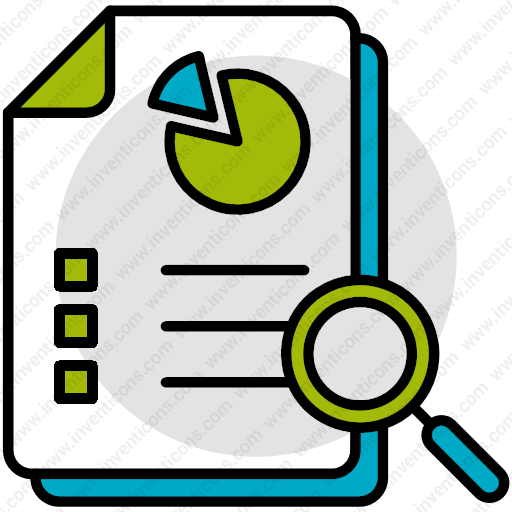

```{r setup, include=FALSE}
options(htmltools.dir.version = FALSE)
library(knitr)
knitr::opts_chunk$set(warning = FALSE, message = FALSE)
# options(knitr.table.format = "html")
library(tidyverse)
library(babynames)
library(fontawesome) # from github: https://github.com/rstudio/fontawesome
library(DiagrammeR)
```


```{r xaringan-scribble, echo=FALSE}

## https://pkg.garrickadenbuie.com/xaringanExtra/#/scribble

xaringanExtra::use_scribble()          ## page load times much worse with this enabled - allows marking on slides
## xaringanExtra::use_slide_tone()     ## use for visually impaired

```

layout: true
  
<div class="my-footer"><span>MPPAW November 21, 2023</span></div> 

<!-- this adds the link footer to all slides, depends on my-footer class in css-->

---
name: xaringan-title
class: left, top, inverse
background-image: url(img/learn2.jpg)
background-size: cover 

# 

<!-- -->

# .fancy2[.BLACK[Everything **BUT** Statistics]]  
### .fancy2[.BLACK[`r fa("r-project",fill="#000000")` for Authoring Websites, Reports, and <br>Presentations ...Oh My!!]]

.large[[`r fa("linkedin", fill="#0077b5")`](https://www.linkedin.com/in/michael-defabiis-84b45b162/) .BLACK[| Mike DeFabiis ] <br>
[`r fa("linkedin", fill="#0077b5")`](https://www.linkedin.com/in/diego-figueiras-m-a-012644123/) .BLACK[| Diego Figueiras ] <br>
[`r fa("linkedin", fill="#0077b5")`](https://www.linkedin.com/in/casey-osorio-duffoo/) .BLACK[| Casey Osorio-Dufoo ] <br>
[`r fa("linkedin", fill="#0077b5")`](https://www.linkedin.com/in/johntkulas/) .BLACK[| John Kulas ]
]

<!-- this ends up being the title slide since seal = FALSE -->
---
name: context
class: center, middle, inverse

# .fancy[The (all too) limited perspective on `r fa("r-project", fill="#4287f5")`:]

--


--
.pull-left[
Statistical Platform <br>(**Used to** use)
]
--
.pull-right[
Statistical Platform <br>(Gonna switch to)
]

---
name: better
class: center, top, inverse

# .fancy[Our perspective on `r fa("r-project", fill="#4287f5")`:]


--


--


     
--


--


     
--


     
--


     
--


     
???

1. statistics
2. presentations
3. websites
4. academic manuscripts
5. technical reports
6. dashboards

And much more. Only really limited by existing package availability, but you could also write your own package.

---

After talking with Diego (9/26) maybe spend more time on automated reports (go from simple to complex) instead of doing 3 things (e.g., maybe drop paper) - focus on reports & website/blog


---

class: center, middle, inverse

.pull-left[
.large[...also note the difference in groupings between options for  .bluecircle[navigation]]... 


]

--

.pull-right[
.large[...and options for .redbracket[presentation]]


]

---

class: left, middle, inverse

## We'll just be focusing on how to use a few of the most popular .redbracket[presentation] options:

.right[

]

---

class: left, middle, inverse

.pull-left[#.fancy[Cloning:]

.large[
+ Most useful if you'd like to use presentation notes  
+ Activated by depressing the ".redbracket[C]" key:  ]
]

.pull-right[ 


]

???

Your notes will be available to you here in presenter mode, but only you will view them as long as you present a "cloned" screen.   

---

class: center, middle, inverse

##.fancy[Cloning] (Continued)

.pull-left[

# 1. `r fa(name = "desktop", fill = "white")`

.large[On the **presentation** screen:

Move the cloned window here, <br>
then press ".redbracket[F]" for full-screen mode]
]

--

.pull-right[

# 2. `r fa(name = "laptop", fill = "white")`

.large[On **your laptop** screen:

Press ".redbracket[P]" for presenter mode] 
]

---

name: draw
class: right, inverse, bottom

.left-column[
# Also take note of the <br> .fat[.fancy["Pencil"!]] `r anicon::faa("pencil-alt", animate="wrench")`
]

.right-column[

]

---
name: ninja
class: middle, inverse

## You can .salt[.fancy[edit]] your slides by activating the pencil:


---

.left-column[
## Interactive Graphics:

.large[Your document elements can have interactive components:]
]

.right-column[

```{r include=FALSE}
library(leaflet)
library(dplyr)
library(reticulate)
```

```{r, echo=FALSE, warning=FALSE}

content <- paste(sep = "<br/>",
  "<b><a href='https://www.mppaw.org/'>MPPAW</a></b>",
  "Minneapolis, MN"
)

ergIcon <- makeIcon(
  iconUrl = "https://media.licdn.com/dms/image/C4D0BAQE912ky8Lab0w/company-logo_200_200/0/1569277429155?e=2147483647&v=beta&t=MKYjtrMIPtpW0eGRzyN2aI_6fSAeHVDS4Ki3FiJaSyo",
  iconWidth = 120, iconHeight = 100,
  iconAnchorX = 30, iconAnchorY = 30,
)

hc_gdpr <- leaflet() %>%
  setView(lng= -93.24649681376336, lat=44.99948959471243, zoom=5) %>%
#   addTiles() %>%
 addProviderTiles(
    "Stamen.Toner",
    group = "Stamen.Toner"
  ) %>%
   addWMSTiles(
    "http://mesonet.agron.iastate.edu/cgi-bin/wms/nexrad/n0r.cgi",
    layers = "nexrad-n0r-900913",
    options = WMSTileOptions(format = "image/png", transparent = TRUE, opacity = 0.35),
    attribution = "Weather data © IEM Nexrad") %>%
    addMarkers(-93.23, 45.0, icon=ergIcon, popup=content)
  #    addCircleMarkers(-93.23, 45.0, popup=content, radius=20)
  #  addPopups(-93.23, 45.0, content,
#    options = popupOptions(closeButton = FALSE)
#)


htmlwidgets::saveWidget(hc_gdpr, "hc_gdpr.html", selfcontained = TRUE, knitrOptions = list())
hc_gdpr
## helpful(?) for interactive plots in GitPages sites:

## http://ryankuhn.net/blog/How-To-Use-Plotly-With-Jekyll

## https://bookdown.org/nicohahn/making_maps_with_r5/docs/leaflet.html
```
]

---

class: left, top, inverse

# .salt[.fancy[Questions???]]
## .fancy[Reach out to us at...]

.pull-left[
  

Mike <br>

  

Casey
]

.pull-right[

Diego <br>

  

[`r fa(name = "paper-plane")` jtkulas@ergreports.com](mailto:jtkulas@ergreports.com)  
[`r fa(name = "x-twitter")` @jtkulas](http://twitter.com/jtkulas)  
[`r fa(name = "youtube")` Forensic Psychometrics](https://www.youtube.com/@forensicpsychometrics8300)
]

