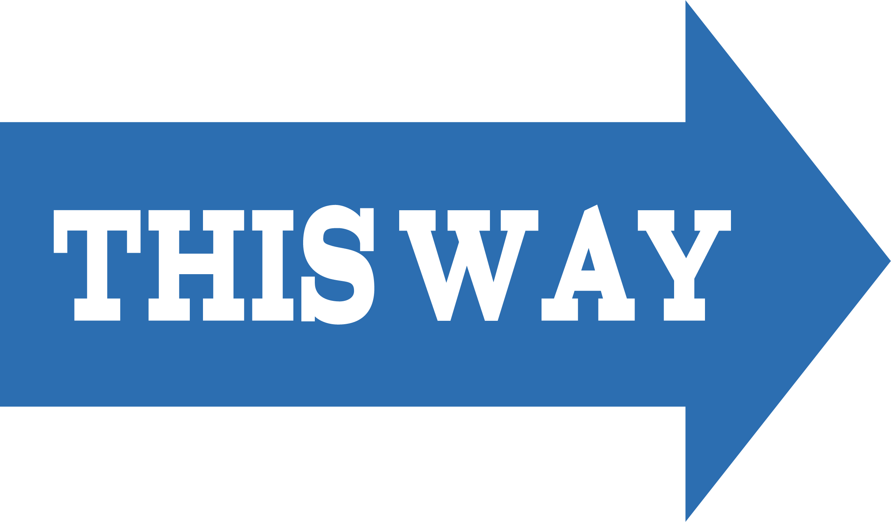
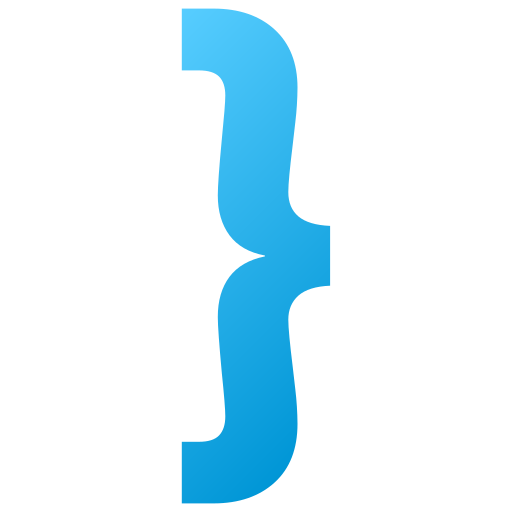

```{r setup, include=FALSE}
options(htmltools.dir.version = FALSE)
library(knitr)
knitr::opts_chunk$set(warning = FALSE, message = FALSE)
# options(knitr.table.format = "html")
library(tidyverse)
library(babynames)
library(fontawesome) # from github: https://github.com/rstudio/fontawesome
library(DiagrammeR)
```


```{r xaringan-scribble, echo=FALSE}

## https://pkg.garrickadenbuie.com/xaringanExtra/#/scribble

xaringanExtra::use_scribble()          ## page load times much worse with this enabled - allows marking on slides
## xaringanExtra::use_slide_tone()     ## use for visually impaired

```

layout: true
  
<div class="my-footer"><span><a href="https://github.com/jtkulas/MPPAW2023"</span>MPPAW November 14, 2023</span></a></div> 

<!-- this adds the link footer to all slides, depends on my-footer class in css-->

---
name: xaringan-title
class: left, top, inverse
background-image: url(img/learn2.jpg)
background-size: cover 

# 

<!-- -->

# .fancy2[.BLACK[Everything **BUT** Statistics]]  
### .fancy2[.BLACK[`r fa("r-project",fill="#000000")` for Authoring Websites, Reports, and <br>Presentations ...Oh My!!]]

.large[[`r fa("linkedin", fill="#0077b5")`](https://www.linkedin.com/in/michael-defabiis-84b45b162/) .BLACK[| Mike DeFabiis ] <br>
[`r fa("linkedin", fill="#0077b5")`](https://www.linkedin.com/in/diego-figueiras-m-a-012644123/) .BLACK[| Diego Figueiras ] <br>
[`r fa("linkedin", fill="#0077b5")`](https://www.linkedin.com/in/casey-osorio-duffoo/) .BLACK[| Casey Osorio-Dufoo ] <br>
[`r fa("linkedin", fill="#0077b5")`](https://www.linkedin.com/in/johntkulas/) .BLACK[| John Kulas ]
]

<!-- this ends up being the title slide since seal = FALSE -->

---
name: context
class: center, middle, inverse

# .fancy[The (much too) common perspective on `r fa("r-project", fill="#4287f5")`:]

--
.pull-left[
I have a statistical program <br>.spssred[(**I currently use**)]
]
--
.pull-right[
I have a statistical program <br>.rblue[(**I'm gonna switch to**)]
]

--


---

class: center, middle, inverse

#.fancy[However...]
##.fancy[...`r fa("r-project", fill="#4287f5")` is not just a statistical substitute]

--

##.fancy[It is actually a .rblue[multipurpose] operating environment]


---
name: new
class: center, top, inverse

# .fancy[A better (more useful) perspective on `r fa("r-project", fill="#4287f5")`:]

--
.pull-left[
I have many platforms <br>.spssred[(**I currently use to navigate my job**)]<br>


]

???
Power of replacement actually comes from Quarto (presented on later slides), with `r fa("r-project", fill="#4287f5")` merely being one current way to use Quarto

--
.pull-right[
I have a 1 (free) platform <br>.rblue[(**to rule them all**)]<br>



]


---

name: better
class: center, top, inverse

# .fancy[Common processes `r fa("r-project", fill="#4287f5")` can power:]  

???

1. statistics
2. presentations
3. websites
4. academic manuscripts
5. books
6. dissertations & theses
7. technical reports
8. dashboards

And much more. Only really limited by YOUR creativity & vision.

--


--


--


     
--


--


--


     
--


--


     
--


     
--


---
name: how
class: center, top, inverse

##.fancy[`r emo::ji("face_with_raised_eyebrow")` How? `r emo::ji("dizzy_face")`]

--

.pull-left[
## .salt[.fancy[Packages!!]]


     

     

]

--


 
 

---
name: whazzr
class: center, middle, inverse


???
+ Typical software program
  + Bell labs and/or U of Aukland "product"
  + 1993 first release
+ Free/open-source
+ Language and platform basically indistinguishable
+ Two primary operating environments (interactive **console** and static **script**)
+ Function over form

--


---
name: whazzrstudio
class: center, middle, inverse


???
+ Commercial but also free - background here: [`r fa("youtube", fill="red")`](https://www.youtube.com/watch?v=u1Gzxg8Pd08)
+ "Founded" roughly 2009
+ Facilitates use of `r fa("r-project")`
+ Function maintained, form improved
+ 4 operating environments
+ Blurred boundaries (we'll refer to `r fa("r-project")` even if we're technically operating within `r fa("r-project")` Studio)  
+ If anyone hasn't installed `r fa("r-project")` or `r fa("r-project")` Studio, **send a private chat to Roger** - he will let us know and we'll help in breakout rooms during intro spiel 

--


---
name: packages
class: center, top, inverse

.pull-left[
## .fancy[[`r fa("r-project", fill="#4287f5")` Packages](https://support.posit.co/hc/en-us/articles/201057987-Quick-list-of-useful-R-packages):]
]

--


--


     
--


     
--

.pull-right[
## .fancy[`r fa("r-project", fill="#4287f5")` "Authoring" Packages:]
]  

???
+ $\LaTeX$ & html (dates unknown)
+ literate programming (1984; code + written text)
  + exploding recently - thanks to RStudio & Jupiter Notebooks
+ markdown (2004)

--


     
--


     
--


---
name: context
class: left, top, inverse

#.fancy[The evolution of authoring packages...]


     
--
     

     
  

???

Quarto actually an independent platform. There is a Quarto `r fa("r-project", fill="#4287f5")` package, but it mostly provides shortcuts for control-line commands. Deep explanation of Quarto with development team available here: [`r fa("youtube", fill="red")`](https://www.youtube.com/watch?v=p5zrqrFqCTo)

---
name: RStudio
class: left, top, inverse

#.fancy[...parallels the evolution of] `r fa("r-project", fill="#4287f5")` .rblue[Studio]:


.pull-left[
#.fancy[`r fa("r-project", fill="#4287f5")` Studio:]


     


]

--


.pull-right[
#.fancy[Posit:]


     


]

???
New branding announced by Hadley Wickham at R Studio 2022 conference - Hadley says Quarto is the new rMarkdown

---
class: center, top, inverse


     

     


--


     


---
name: timing
class: left, top, inverse

# .fancy[Timing (for us as a field):]

.pull-left[
.large[`r fa("r-project")`Studio is a [Public Benefit Corporation](https://www.law.cornell.edu/wex/public_benefit_corporation#:~:text=A%20public%20benefit%20corporation%20is,a%20responsible%20and%20sustainable%20manner.) with a mission to create free and open source software for *data science*, *scientific research*, and .kindabig[.rblue[*technical communication*]]
]
]

.pull-right[

]

???
Hadley and JJ referred to this as their "charter"

---
name: tonight
class: left, top, inverse

#.fancy[.salt[Tonight:]]

##.fancy[We'll be using both the "legacy" .rblue[rmarkdown] packages as well as the "new" .rblue[Quarto] platform to generate:]

???
+ A template business report
+ A website
+ An automation of our business report
  + Go from simple to complex

--


     
--


--


---
class: center, top, inverse

# .fancy[Outline]:

.pull-left[.salt[10-15 minute] <br>.large[overview]]

.pull-right[.heat[10 minute] <br>.large[working session]]

--


--


     
--


--


--


--


--


     
--


--


     
???
+ The breakout sessions will start at 10 minutes 
    + We can extend if necessary/requested after the first 10 minute breakout
+ Slides will be pasted into the chat at the end of each overview section

---
class: left, top, inverse

##.salt[.fancy[Additional resources:]]

.pull-left[
###.fancy[Alison Hill]: 
+ [`r fa("github")`](https://github.com/apreshill) Source code
+ [`r fa("youtube", fill="red")`](https://www.youtube.com/channel/UCQYM-t2ut2zXr4d7TIFya1A) Tutorials
+ [`r fa("blog")`](https://www.apreshill.com/) Personal blog
]

.pull-right[
###.fancy[Yihui Xie]:  
+ [`r fa("github")`](https://github.com/yihui) Source code & sassy talk
+ [`r fa(name = "x-twitter")`](https://twitter.com/xieyihui?lang=en) Twitter stuff
+ [`r fa("blog")`](https://yihui.org/) Personal blog  

###.fancy[Posit PBC]:  
+ [`r fa("youtube", fill="red")`](https://www.youtube.com/@PositPBC) Tutorials (Tom Mock does Quarto)
+ [`r fa("message")`](https://community.rstudio.com/) Discussion forum
+ [`r fa(name="x-twitter")`](https://twitter.com/posit_pbc) Not very active


]

---

class: left, top, inverse

# .salt[.fancy[Questions???]]
## .fancy[Reach out to us at...]

.pull-left[
  

Mike <br>

  

Casey
]

.pull-right[

Diego <br>

  

[`r fa(name = "paper-plane")` jtkulas@ergreports.com](mailto:jtkulas@ergreports.com)  
[`r fa(name = "x-twitter")` @jtkulas](http://twitter.com/jtkulas)  
[`r fa(name = "youtube")` Forensic Psychometrics](https://www.youtube.com/@forensicpsychometrics8300)
]

